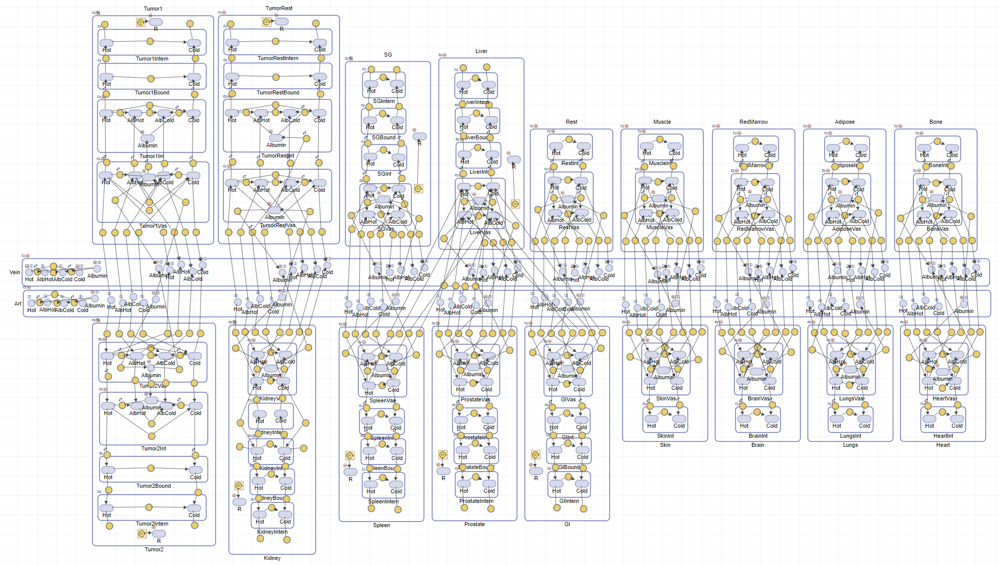
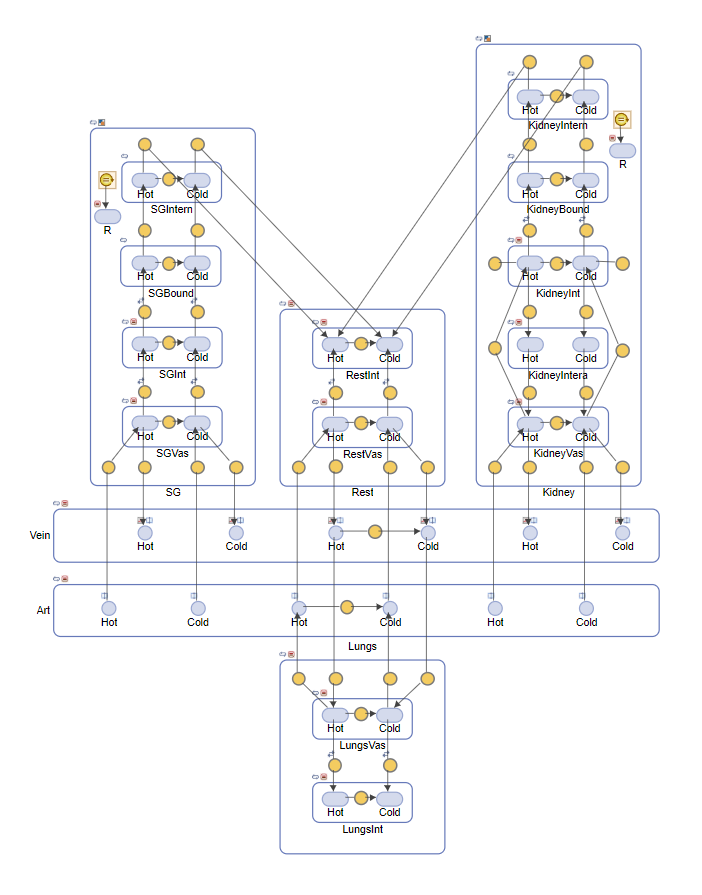

<h1>
  
  PyCNO
</h1>

## Description

Welcome to PyCNO - Python Computational Nuclear Oncology! This repository is centered around computational methods for theranostics and nuclear oncology, including virtual theranostic trials (VTTs) and radiopharmaceutical therapy (RPT) optimization studies. Currently, the repository contains prostate-specific membrane antigen (PSMA) physiologically based pharmacokinetic (PBPK) models. We are building this framework to support multiple models and further resources (e.g. pharmacodynamic (PD) modeling) for studying and optimizing RPTs.

The present repository contains **Python** implementation of PBPK modeling of RPTs as elaborated in the following paper:

["Physiologically based radiopharmacokinetic (PBRPK) modeling to simulate and analyze radiopharmaceutical therapies: studies of non-linearities, multi-bolus injections, and albumin binding"
](https://link.springer.com/article/10.1186/s41181-023-00236-w)

EJNMMI Radiopharmacy and Chemistry, vol. 9, pp. 6, 2024

We also have a simplified model and plan to release models in the future that incorporate more features (immune response, pharmacodynamic modelling, etc.) as well as other radioligands.

<table>
<tr>
<td>

### Original Model  

Model from the publication listed above. Includes multiple lesions, organs at risk and other organs.

</td>
<td>



</td>
</tr>

<tr>
<td>

### Reduced Model  

Simplified model with only key organs. This model does not include lesions.
</td>
<td>



</td>
</tr>
</table>

The original model was implemented in **MATLAB SimBiology** and can be found in the "matlab" directory. It has also been exported in the Systems Biology Markup Language (SBML) using the SBMLConversion.m script. The functions.py script contains some functions for using the SBML file in Python, along with example usage in example_script.py. The motivation for having the model in Python is twofold:

1. Open Source - Can be run by anyone without a MATLAB license
2. Easily integrated into other Python workflows

That being said, we acknowledge the advantages of MATLAB SimBiology (namely the model GUI), and ourselves do a lot of model modifications in SimBiology, and then export the final product for integration into other workflows in Python. As such, we have included a short script in the MATLAB folder for seamless conversion from SimBiology to an SBML version compatible with PyCNO.

Finally, this is a new repository, so we are making improvements. Check back for updates!

## Installation

1. Clone the repository:
   ```sh
   git clone https://github.com/qurit/PyCNO
   ```
2. Install:
   
   First navigate to cloned repository.
   ```sh
   conda create -n pycno_env -c conda-forge python=3.12
   conda activate pycno_env
   pip install -e .
   ```

## Usage

To get started in **Python**, see the examples folder.

To get started in **MATLAB Simbiology**, open the .sbproj file in the "matlab" directory. This will open a MATLAB-based GUI where the model can be explored, edited, and run. If you wish to export your altered MATLAB Simbiology model to be run in Python, use the export_model.m script as found in the "matlab" directory.

## Future
Stay tuned for more updates coming soon, including: optimization methods for fitting patient data, digital twinning of patients based on pre-therapy PET imaging, and more!

## **Citation**
<table>
<tr>
<td>

If you use this repository, please cite the original paper that created the PBPK engine:
> **Fele-Paranj, A., Saboury, B., Uribe, C., & Rahmim, A.**  
> *Physiologically based radiopharmacokinetic modeling to simulate and analyze radiopharmaceutical therapies: studies of non-linearities, multi-bolus injections, and albumin binding*.  
> **EJNMMI Radiopharmacy and Chemistry, vol. 9, pp. 6, 2024**  
> DOI: [10.1186/s41181-023-00236-w](https://doi.org/10.1186/s41181-023-00236-w) 

</td>
<td>


</td>
</tr>
</table>
